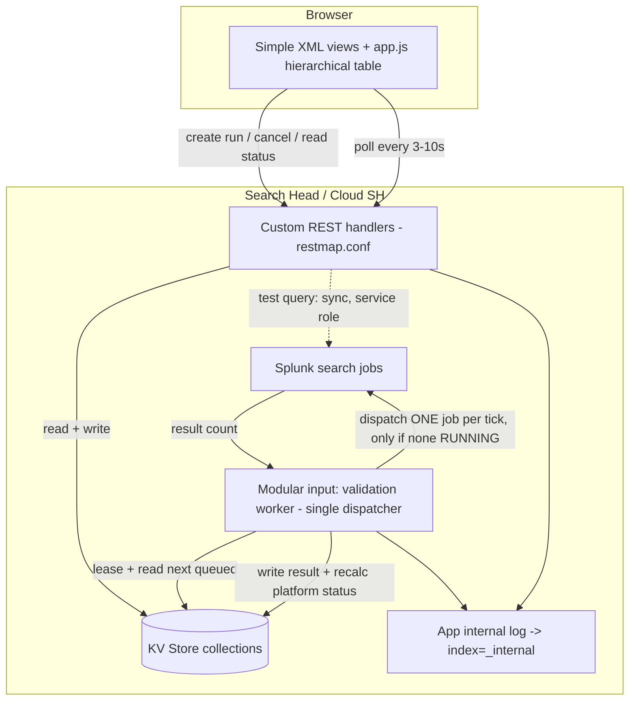

# Data Source Validator — Build Handoff

A Splunk app that validates whether each user-defined **data source** currently
returns **≥ 1 event**, with data sources grouped under parent **platforms**.
Targets Splunk Cloud Platform + Splunk Enterprise 9.3+, built for **Splunkbase**
submission (must pass AppInspect + Cloud vetting).

## How to continue in Claude Code
1. Open this folder as your project.
2. Paste the **Continuation prompt** at the bottom of this file.
3. Run the offline validator anytime: `python3 tools/validate_phase1.py`

Build proceeds in phases. **Phase 1 (config + manifest) is complete and passes
the validator.** Phases 2–5 remain.

---

## Locked decisions (do not re-litigate without asking)
- **Search identity — dedicated service role for ALL searches** (batch runs *and*
  ad-hoc "test query"). A customer-provisioned **service account** in role
  `dsv_service` (least privilege: explicit `srchIndexesAllowed`, real-time search
  off, no admin capabilities) is authenticated via a credential stored in
  **encrypted `storage/passwords`** through the app **setup page**. No credentials
  are embedded in the package. This is the auth-layer boundary that stops the app
  reading data the service role may not search.
- **Sequential execution** — a single **modular-input worker**
  (`dsv_validation_worker`) is the *only* search dispatcher. Exactly one search
  job in flight at a time (it dispatches only when nothing is RUNNING). All
  run/queue/result state lives in **KV Store**, so a browser refresh, disconnect,
  or reconnect never starts duplicate searches and never loses progress. A **KV
  Store lease** guarantees one active worker across search-head-cluster members
  (this lease/heartbeat also feeds the Health dashboard).
- **Storage** — KV Store, 7 collections (see `default/collections.conf`). No
  secrets in KV Store.
- **UI** — Simple XML + custom `app.js`/`app.css`. Dashboard Studio cannot do the
  interactive checkbox tree with indeterminate parent state.
- **Platform/versions** — min Splunk **9.3**, **Python 3.9** runtime, license
  **Apache 2.0**.

---

## Architecture



**Run lifecycle:** UI → `POST /datasource_validator/run` writes a `validation_runs`
doc + N ordered `validation_queue` items (status QUEUED) → returns `run_id`. Each
worker tick: if an item is RUNNING, poll its job and, on completion, record the
result + recalc the parent platform status; else dispatch exactly one next-queued
job (bounded time range, `| head 1` only when safe, dispatch + timeout controls)
and mark it RUNNING. The UI polls status via REST every 3–10s and **never drives
execution**, which is what makes browser refresh safe.

Ordering: run creation order → `platform.sort_order` → `datasource.sort_order`
→ name. Queue items carry a status guard + unique `_key` so none executes twice.

---

## Status rules (implement in `status_calculator`, Phase 2)
- **Data source:** PASS (≥1 result) / FAIL (0 results) / ERROR (could not
  complete — a *distinct internal state* from FAIL) / RUNNING / QUEUED / NOT RUN /
  DISABLED / CANCELLED, with a **STALE** overlay when a prior PASS is older than
  the configurable threshold. Editing a query bumps `query_version` + `query_hash`
  and resets current status to NOT RUN (a stale green must not validate new SPL).
- **Platform:** green only if enabled-child-count > 0 **and** every enabled child
  is a fresh PASS; **amber** if all enabled children pass but ≥1 is stale, or ≥1 is
  NOT RUN/CANCELLED; **red** if any enabled child is FAIL or ERROR; **running** if
  any child is running or queued in the active batch; **grey** if the platform is
  disabled or has zero enabled children. A platform is **never** green on zero
  enabled children. Disabled children never affect platform status.
- Colour is never the only signal: every state also has a text label, icon, and
  accessible description.

---

## Query safety (implement in `query_validator`, Phase 2 — most security-critical)
Treat user SPL as untrusted; **fail closed**:
1. Parse via the supported `/services/search/parser` endpoint to enumerate
   commands robustly (handles pipes, comments, quoting, subsearches, macro
   expansion) — do **not** rely on a naive regex.
2. Normalize command names; reject if any parsed command is in the denylist:
   `collect, outputlookup, outputcsv, mcollect, meventcollect, tscollect,
   sendemail, sendalert, script, run, rest, delete, map, loadjob, savedsearch,
   dbxquery` (extend as needed).
3. Require a read-only leading command (`search, tstats, mstats, from, datamodel,
   metadata, inputlookup`); anything else requires the admin allowlist.
4. Reject if the parser is unavailable or anything is ambiguous.
5. Append `| head 1` **only** for pure streaming event searches with no
   transforming/generating/limiting command; otherwise run as-is and check
   `resultCount ≥ 1`. Never alter query meaning.

---

## DONE — Phase 1 (validated: 7 `.conf` + manifest, no dup stanzas/keys, versions consistent)
```
datasource_validator/
  app.manifest            # PackagingToolkit schema 2.0.0, SH-only, 9.3+
  README.md
  LICENSE                 # Apache 2.0
  default/
    app.conf              # is_configured=false, setup_view=setup, updates on
    authorize.conf        # 4 caps + 4 roles + least-priv dsv_service role
    collections.conf      # 7 KV Store collections, typed + accelerated
    restmap.conf          # 11 authenticated REST endpoints, capability-gated per method
    web.conf              # exposes the endpoints to Splunk Web
    inputs.conf           # dsv_validation_worker modular input (disabled until setup)
    props.conf            # parses the app's own JSON operational log
  metadata/
    default.meta          # least-privilege object permissions, no admin_all_objects
```
Deliberately **omitted** per the "no empty/placeholder files" rule:
`commands.conf` (no custom SPL command is needed) and `savedsearches.conf`
(deferred to Phase 3 — housekeeping only).

---

## NEXT
- **Phase 2 — `bin/app/`:** `logging_utils.py`, `security.py`, `query_validator.py`,
  KV Store model accessors (platform / datasource / run / queue / result /
  settings), `status_calculator.py` + `tests/unit/`.
- **Phase 3 — `bin/`:** `search_executor.py`, `validation_controller.py` (the
  modular input), `rest_config.py` / `rest_validation.py` / `rest_query.py` /
  `rest_health.py`; `default/savedsearches.conf` (retention + heartbeat rollup);
  `tests/` with **mocked** search-job APIs.
- **Phase 4 — UI:** `default/data/ui/views/` (home, platforms, datasources, queue,
  validation_history, health, setup) + `nav/default.xml`;
  `appserver/static/app.js`, `app.css`, images.
- **Phase 5 — docs + packaging:** `README/` (INSTALL, CONFIGURE, USER_GUIDE,
  SECURITY, PRIVACY, SUPPORT, TROUBLESHOOTING, RELEASE_NOTES); threat model; build
  script (clean → conf/XML/JSON lint → unit tests → secret scan → dependency scan →
  AppInspect → `.tar.gz` → SHA-256 → build report); Splunk Cloud validation
  checklist; Splunkbase listing text; final **evidence-based quality-gate table**.

---

## Verify in your environment (could NOT be verified in the chat sandbox — no network there)
- The minimal capability set `dsv_service` needs to *dispatch* a non-RT search in
  your Splunk version. It's kept bare for least privilege; add a base capability
  only if your deployment requires it.
- Modular-input index behaviour: the worker is a control loop that emits
  operational logs to the app log file (→ `_internal` via the platform's standard
  log monitor) and keeps state in KV Store. Confirm AppInspect doesn't flag the
  input for lacking an `index`.
- **Run AppInspect for real** (`splunk-appinspect inspect <pkg> --mode precert`
  and/or the AppInspect API / Splunkbase submission). The chat build could not run
  it, so no quality gate should be marked "Pass" for AppInspect until you do.

## Placeholders to fill (search the tree for bracketed tokens)
`[YOUR ORG]`, `[SUPPORT EMAIL]`, `[SUPPORT MODEL]`, and the `dsv_service` role's
allowed indexes (per deployment).

---

## Continuation prompt (paste into Claude Code)
> Continue building the Splunk "Data Source Validator" app in this repo. Read
> `HANDOFF.md` for the locked decisions, architecture, status rules, and
> query-safety design. Phase 1 (config + manifest) is complete and passes
> `tools/validate_phase1.py`. Build **Phase 2** now: the `bin/app` Python core —
> `logging_utils`, `security`, `query_validator` (parser-based SPL safety,
> fail-closed, exactly as specified in HANDOFF), KV Store model accessors for all
> 7 collections, and `status_calculator` implementing the platform / data-source /
> staleness rules — with unit tests under `tests/unit` that mock all Splunk APIs
> and need no network or real credentials. Keep everything Splunk Cloud +
> AppInspect compatible: no shell, no OS-process execution, no filesystem writes
> outside supported app paths, TLS on, secrets only in `storage/passwords`, least
> privilege throughout. Produce complete executable code — no placeholders for
> core logic. Then extend `tools/validate_phase1.py` (or add a new validator) to
> also check Python syntax + a lint pass, and run it.
